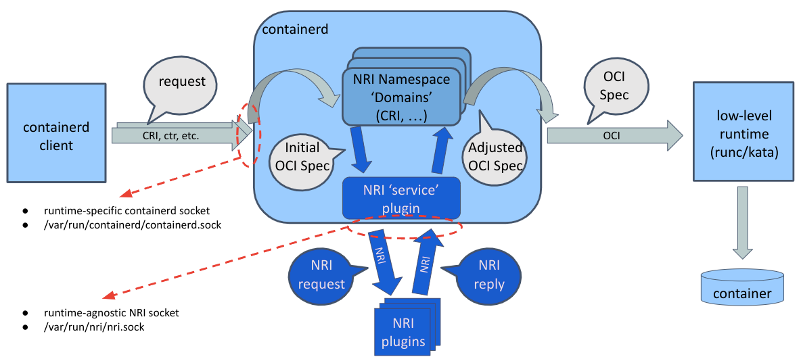

# containerd 中的 NRI 支持 {#nri-support-in-containerd}

## Node Resource Interface {#node-resource-interface}

NRI，即 Node Resource Interface，是一个把扩展插入到兼容 OCI 的容器运行时中的
通用框架。它为 plugin 提供了跟踪容器状态、以及对容器配置做有限修改的基础机制。

NRI 本身与任何容器运行时的内部实现细节无关。它提供了一个适配库，供运行时用来
接入 NRI 并与 NRI 和 plugin 交互。原则上，任何 NRI plugin 都应该能与启用了 NRI
的运行时协同工作。

关于 NRI 及其能力的详细说明，请参阅
[NRI 仓库](https://github.com/containerd/nri)。

## containerd 的 NRI 集成 {#containerd-nri-integration}

<details>
<summary>see the containerd/NRI integration diagram</summary>

</details>

containerd 中的 NRI 支持在逻辑上和物理上都分为两部分。这两部分分别是用于接入 NRI
的通用 plugin（`/internal/nri/*`），以及 CRI 相关的部分（`/internal/cri/nri`），
后者负责在与运行时无关的 NRI 表示和 CRI 插件的内部表示之间转换数据。

### containerd NRI plugin {#containerd-nri-plugin}

containerd 的通用 NRI plugin 实现了接入 NRI 并与之交互的核心逻辑。不过，它在实现
这些逻辑时并不了解 containerd 内部对容器或 pod 的表示方式。它定义了一个额外的接口
Domain，每当需要把容器或 pod 的内部表示转换为与运行时无关的 NRI 表示，或者需要把
外部 NRI plugin 请求的配置变更应用到 containerd 中的某个容器时，就会用到这个接口。
`Domain` 可以看作 Domain-Namespace 的简称，因为 Domain 实现了通用 NRI 接口在处理
某个特定 containerd namespace 中的 pod 和容器时所需的函数。提醒一下，containerd
namespace 用于隔离 containerd 各个客户端之间的状态。例如 "k8s.io" 对应 Kubernetes
CRI 客户端，"moby" 对应 docker 客户端……而 "containerd" 是 containerd/ctr 的默认
namespace。

### CRI 容器的 NRI 支持 {#nri-support-for-cri-containers}

containerd 的 CRI 插件把自己注册为上面提到的 "k8s.io" namespace 的 NRI Domain，
从而允许外部 NRI plugin 自定义容器配置。

### 其他容器 'Domain' 的 NRI 支持 {#nri-support-for-other-container-domains}

这样拆分功能的主要原因，是为了让 NRI plugin 也能服务于其他类型的 sandbox，以及
除 "k8s.io" namespace 中的 CRI 容器之外的其他容器客户端。

## 在 containerd 中禁用 NRI 支持 {#disabling-nri-support-in-containerd}

启用和禁用 containerd 中的 NRI 支持，是通过启用或禁用 containerd 的通用 NRI plugin
来实现的。从 containerd 2.0 开始，该 plugin（以及相应的 NRI 功能）默认是启用的。
可以通过编辑 containerd 配置文件（默认为 `/etc/containerd/config.toml`）中的
`[plugins."io.containerd.nri.v1.nri"]` 小节，把 `disable = false` 改为
`disable = true` 来禁用它。用于禁用 NRI 功能的 NRI 小节大致如下：

```toml
  [plugins."io.containerd.nri.v1.nri"]
    # Disable NRI support in containerd.
    disable = true
    # Allow connections from externally launched NRI plugins.
    disable_connections = false
    # plugin_config_path is the directory to search for plugin-specific configuration.
    plugin_config_path = "/etc/nri/conf.d"
    # plugin_path is the directory to search for plugins to launch on startup.
    plugin_path = "/opt/nri/plugins"
    # plugin_registration_timeout is the timeout for a plugin to register after connection.
    plugin_registration_timeout = "5s"
    # plugin_request_timeout is the timeout for a plugin to handle an event/request.
    plugin_request_timeout = "2s"
    # socket_path is the path of the NRI socket to create for plugins to connect to.
    socket_path = "/var/run/nri/nri.sock"
```

启动 NRI plugin 有两种方式。plugin 可以被预先注册，这种情况下它们会在 NRI 适配层
实例化时（在我们这里也就是 containerd 启动时）自动启动。plugin 也可以由外部方式
启动，例如通过 systemd。

预先注册一个 plugin 的做法是，把指向该 plugin 可执行文件的符号链接放到一个约定的
NRI 专用目录中，默认是 `/opt/nri/plugins`。预先注册的 plugin 在启动时会带有一个已
预先连接到 NRI 的 socket。由外部启动的 plugin 则连接到一个约定的 NRI 专用 socket
（默认是 `/var/run/nri/nri.sock`）来注册自己。预先注册的 plugin 和外部启动的 plugin
之间唯一的区别就是它们如何被启动、如何连接到 NRI。一旦连接建立，所有 plugin 都是
一样的。

NRI 可以配置为禁止来自外部启动的 plugin 的连接，这种情况下那个约定的 socket 根本
不会被创建。上面展示的配置片段确保无论 NRI 的内置默认值如何，外部连接都是启用的。
这对测试很方便，因为它允许你随时连接、断开和重新连接 plugin。

注意，你不能在同一个节点上以相同的默认 socket 配置运行两个启用了 NRI 的运行时。
你需要在其中一个运行时中禁用 NRI，或者修改 NRI socket 路径。

## 测试 containerd 中的 NRI 支持 {#testing-nri-support-in-containerd}

你可以按上文所述配置 containerd 和 NRI，然后从 github 上的
[NRI 仓库](https://github.com/containerd/nri/tree/main/plugins/logger)
取出 NRI logger plugin，编译并启动它，以此验证 NRI 集成是否已正确启用并正常工作。

```bash
git clone https://github.com/containerd/nri
cd nri
make
./build/bin/logger -idx 00
```

你应该会看到 logger plugin 收到一份已有 pod 和容器的列表。之后如果你使用 crictl 或
kubectl 创建或删除更多 pod 和容器，你应该会看到 logger 打印出相应 NRI 事件的详细
日志。

## 与 v0.1.0 plugin 的 NRI 兼容性 {#nri-compatibility-with-v010-plugins}

你可以使用
[v010-adapter plugin](https://github.com/containerd/nri/tree/main/plugins/v010-adapter)
启用对 NRI v0.1.0 plugin 的向后兼容。

```bash
git clone https://github.com/containerd/nri
cd nri
make
sudo cp build/bin/v010-adapter /usr/local/bin
sudo mkdir -p /opt/nri/plugins
sudo ln -s /usr/local/bin/v010-adapter /opt/nri/plugins/00-v010-adapter
```

## 默认校验器 {#default-validator}

内置的默认 NRI 校验器 plugin 可以用来有选择地锁定 NRI 中提供的部分容器控制能力。
你可以在 containerd 配置文件中使用下面的 toml 片段来启用和配置该默认校验器：

```toml
  [plugins.'io.containerd.nri.v1.nri'.default_validator]
      enable = <true|false>
      reject_oci_hook_adjustment = <true|false>
      reject_runtime_default_seccomp_adjustment = <true|false>
      reject_unconfined_seccomp_adjustment = <true|false>
      reject_custom_seccomp_adjustment = <true|false>
      reject_namespace_adjustment = <true|false>
      required_plugins = [ <list of required NRI plugins> ]
      tolerate_missing_plugins_annotation = <annotation key name for toleration>
```

使用这份配置，你可以有选择地禁用
  - OCI hook 注入
  - 对默认 seccomp 策略的调整
  - 对 unconfined seccomp 策略的调整
  - 对自定义 seccomp 策略的调整
  - 对 linux namespace 的调整

此外，你还可以要求某一组 NRI plugin 必须始终存在，容器创建才能成功，并指定一个
annotation key，用于在其他情况下对容器进行标注。
