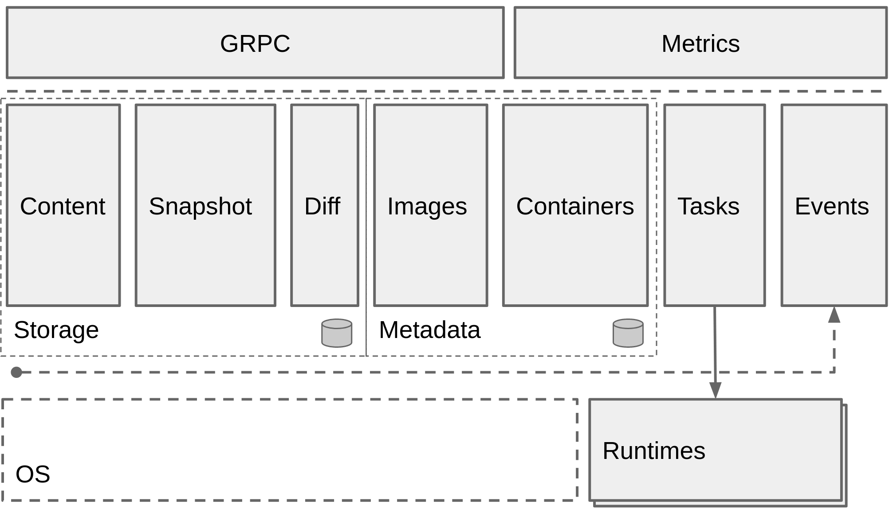
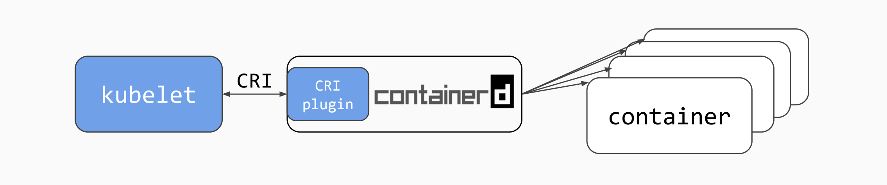

[](https://pkg.go.dev/github.com/containerd/containerd/v2)
[](https://github.com/containerd/containerd/actions?query=workflow%3ACI+event%3Amerge_group)
[](https://github.com/containerd/containerd/actions?query=workflow%3ANightly)
[](https://goreportcard.com/report/github.com/containerd/containerd/v2)
[](https://bestpractices.coreinfrastructure.org/projects/1271)
[](https://scorecard.dev/viewer/?uri=github.com/containerd/containerd)
[](https://github.com/containerd/containerd/actions/workflows/links.yml)

containerd 是一个业界标准的容器运行时，强调简洁、健壮和可移植。它以 daemon 的形式提供给 Linux 和 Windows，能够管理其宿主系统上完整的容器生命周期：image 传输与存储、容器执行与监管、底层存储与网络挂接等等。

containerd 是 CNCF 成员项目，处于 ['graduated'](https://landscape.cncf.io/?selected=containerd)（毕业）状态。

containerd 的设计目标是嵌入到更大的系统中，而不是由开发者或最终用户直接使用。



## 公告 {#announcements}

### 正在招募 {#now-recruiting}

我们是一个大型的、包容的开源项目，欢迎任何形式的帮助：
* 需要文档方面的帮助，让产品更易于使用和扩展。
* 我们需要开源社区推广/组织方面的帮助来扩大影响力；管理和创作宣传及教育内容；并在社交媒体、社区论坛/群组和 google groups 上提供帮助。
* 我们正在积极邀请新的[安全顾问](https://github.com/containerd/project/blob/main/GOVERNANCE.md#security-advisors)加入团队。
* 不断有新的子项目被创建，无论核心还是非核心，都需要更多开发方面的帮助。
* 每个 [containerd 项目](https://github.com/containerd)都有一份当前正在处理或需要帮助解决的 issue 列表。
  - 如果某个 issue 尚未指派给任何人，或长时间没有进展，而你又有兴趣，欢迎来询问。
  - 如果你想从较小的/入门级的 issue 开始，可以查找带 `exp/beginner` 标签的 issue，例如 [containerd/containerd 的入门级 issue](https://github.com/containerd/containerd/issues?q=is%3Aissue+is%3Aopen+label%3Aexp%2Fbeginner)。

## 快速开始 {#getting-started}

参见 [containerd.io](https://containerd.io) 上的文档：
* [运维和管理员指南](ops.md)
* [namespaces](namespaces.md)
* [客户端选项](client-opts.md)

想开始为 containerd 做贡献，参见 [CONTRIBUTING](CONTRIBUTING.md)。

如果你想试用 containerd，参见我们的示例[快速上手](getting-started.md)。

## 每夜构建 {#nightly-builds}

每夜构建可以在[这里](https://github.com/containerd/containerd/actions?query=workflow%3ANightly)下载。
二进制文件每晚从 `main` 分支为 `Linux` 和 `Windows` 生成。

请注意：每夜构建可能包含严重缺陷，不建议用于生产环境，也不提供支持。

## Kubernetes（k8s）CI 面板分组 {#kubernetes-k8s-ci-dashboard-group}

[containerd 的 k8s CI 面板分组](https://testgrid.k8s.io/containerd)包含针对 main 分支和若干 containerd 发布分支运行时 kubernetes 的健康状况测试结果。

- [containerd-periodics](https://testgrid.k8s.io/containerd-periodic)

## 运行时要求 {#runtime-requirements}

containerd 的运行时要求非常低。与 Linux 和 Windows 容器特性集的大部分交互都由
[runc](https://github.com/opencontainers/runc) 和/或特定操作系统的库处理（例如 Microsoft 的
[hcsshim](https://github.com/Microsoft/hcsshim)）。
当前所需的 `runc` 版本记录在 [RUNC.md](RUNC.md) 中。

containerd 核心代码和 snapshotter 使用了一些特定特性，它们在 Linux 上要求最低内核版本。考虑到发行版内核
版本号的特殊性，Linux 上一个合理的起点是最低 4.x 内核版本。

默认使用的 overlay 文件系统 snapshotter 依赖的特性在 4.x 内核系列中才最终定型。如果你选择使用 btrfs，
内核版本可以更灵活一些（推荐最低 3.18），但需要在你的 Linux 发行版上安装 btrfs 内核模块和 btrfs 工具。

要使用 Linux 的 checkpoint 和 restore 特性，你的系统上需要安装 `criu`。更多细节参见
[Checkpoint 和 Restore](features.md#checkpoint-and-restore)。

面向开发者的构建要求列在 [BUILDING](BUILDING.md) 中。


## 支持的 registry {#supported-registries}

任何符合 [OCI Distribution Specification](https://github.com/opencontainers/distribution-spec)
的 registry 都被 containerd 支持。

关于 registry 的配置，参见 [registry 主机配置文档](hosts.md)

## 特性 {#features}

关于 containerd 核心概念及其所支持特性的详细概览，请参阅 [FEATURES.MD](features.md) 文档。

### 发布版本与 API 稳定性 {#releases-and-api-stability}

关于 containerd 各组件的版本号与稳定性细节，请参见 [RELEASES.md](RELEASES.md)。

所有正式发布版本的 64 位 Intel/AMD 二进制文件可在我们的[发布页面](https://github.com/containerd/containerd/releases)下载。

对于其他架构和发行版的支持，你会发现许多 Linux 发行版打包了自己的 containerd 并提供多种架构，例如
[Canonical 的 Ubuntu 打包](https://launchpad.net/ubuntu/bionic/+package/containerd)。

#### 启用命令自动补全 {#enabling-command-auto-completion}

从 containerd 1.4 开始，urfave 客户端自动生成 bash 和 zsh 自动补全数据的特性已启用。以 bash shell 为例，
要使用自动补全功能，在你的 `.bashrc` 中 source autocomplete/ctr 文件，或者手动执行：

```
$ source ./contrib/autocomplete/ctr
```

#### 分发面向 bash 和 zsh 的 `ctr` 自动补全 {#distribution-of-ctr-autocomplete-for-bash-and-zsh}

对于 bash，把 `contrib/autocomplete/ctr` 脚本复制到 `/etc/bash_completion.d/` 并重命名为 `ctr`。
`zsh_autocomplete` 文件同样可用，zsh 用户可以照此使用。

如果你没有把自动补全文件放在用户 shell 环境会自动加载的位置，请向用户提供文档，说明如何把该文件
`source` 进他们的 shell。

### CRI {#cri}

`cri` 是 [containerd](https://containerd.io/) 的一个插件，实现了 Kubernetes 的[容器运行时接口（CRI）](https://github.com/kubernetes/cri-api/blob/master/pkg/apis/runtime/v1/api.proto)。有了它，你就可以把 containerd 用作 Kubernetes 集群的容器运行时。



#### CRI 状态 {#cri-status}

`cri` 是 containerd 的原生插件。从 containerd 1.1 起，cri 插件被编入发布二进制文件并默认启用。

`cri` 插件已达到 GA 状态，这表示它：
* 特性完备
* 可与 Kubernetes 1.10 及以上版本配合工作
* 通过全部 [CRI 校验测试](https://github.com/kubernetes/community/blob/master/contributors/devel/sig-node/cri-validation.md)。
* 通过全部 [node e2e 测试](https://github.com/kubernetes/community/blob/master/contributors/devel/sig-node/e2e-node-tests.md)。
* 通过全部 [e2e 测试](https://github.com/kubernetes/community/blob/master/contributors/devel/sig-testing/e2e-tests.md)。

结果可在 containerd 的 k8s [测试面板](https://testgrid.k8s.io/containerd)查看

#### 校验你的 `cri` 配置 {#validating-your-cri-setup}
Kubernetes 的孵化项目 [cri-tools](https://github.com/kubernetes-sigs/cri-tools) 包含了一些用于检验 CRI 实现的程序。更重要的是，cri-tools 包含 `critest` 程序，用于运行 [CRI 校验测试](https://github.com/kubernetes/community/blob/master/contributors/devel/sig-node/cri-validation.md)。

#### CRI 指南 {#cri-guides}
* [使用 Ansible 和 Kubeadm 安装](contrib/ansible/README.md)
* [非 Ansible 用户：使用发布 tarball 和 Kubeadm 进行自定义安装](getting-started.md)
* [CRI 插件测试指南](cri/testing.md)
* [使用 `crictl` 调试 Pod、容器和 image](cri/crictl.md)
* [配置 `cri` 插件](cri/config.md)
* [配置 containerd](https://github.com/containerd/containerd/blob/main/docs/man/containerd-config.8.md)

### 交流 {#communication}

异步交流和长期讨论请使用 GitHub 仓库上的 issue 和 pull request。这是讨论设计与实现的最佳场所。

同步交流请到 Cloud Native Computing Foundation（CNCF）Slack（`cloud-native.slack.com`）的 `#containerd` 和 `#containerd-dev` 频道找我们。欢迎所有人加入交流。[获取 CNCF Slack 邀请。](https://slack.cncf.io)

欢迎参加我们下一次通过 Zoom 举行的社区会议。日程发布在 [CNCF 日历](https://www.cncf.io/calendar/)上（搜索 'containerd' 进行筛选）。

### 安全审计 {#security-audit}

containerd 项目的安全审计报告托管在我们的网站上。更多信息请参见 [containerd.io 的安全页面](https://containerd.io/security/)。

### 报告安全问题 {#reporting-security-issues}

请按照 [containerd/project](https://github.com/containerd/project/blob/main/SECURITY.md#reporting-a-vulnerability) 中的说明操作

## 许可证 {#licenses}

containerd 代码库以 [Apache 2.0 许可证](LICENSE)发布。
README.md 文件以及 "docs" 目录中的文件采用 Creative Commons Attribution 4.0 International License
授权。你可以在 http://creativecommons.org/licenses/by/4.0/ 获取该许可证的副本，其名称为 CC-BY-4.0。

## 项目详情 {#project-details}

<strong>containerd</strong> 是更广泛的 containerd GitHub 组织中的主要开源项目。
不过，该组织下的所有项目都共用同一套维护者体系、治理方式和贡献指南，这些内容统一存放在一个供所有
containerd 项目共用的 `project` 仓库中。

请查阅所有这些核心项目文档，包括：
 * [项目治理](https://github.com/containerd/project/blob/main/GOVERNANCE.md)、
 * [维护者名单](https://github.com/containerd/project/blob/main/MAINTAINERS)、
 * 以及[贡献指南](https://github.com/containerd/project/blob/main/CONTRIBUTING.md)

相关信息位于我们的 [`containerd/project`](https://github.com/containerd/project) 仓库中。

## 采用者 {#adoption}

想知道谁在使用 containerd？你是否在某个项目中使用 containerd？
欢迎通过 pull request 把自己添加到我们的 [ADOPTERS.md](./ADOPTERS.md) 文件中。
