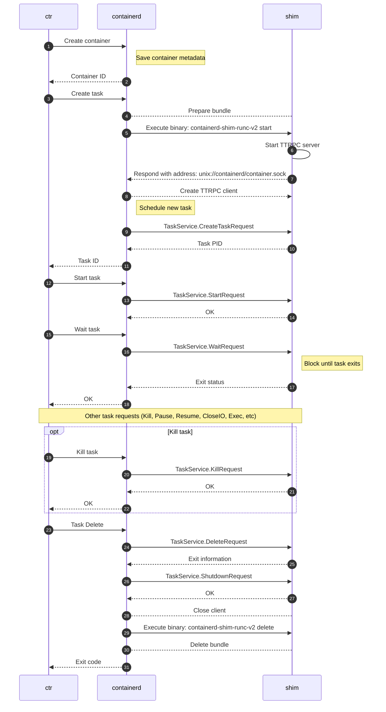

# Runtime v2 {#runtime-v2}

Runtime v2 为运行时作者提供了一等公民的 shim API，用于与 containerd 集成。

containerd 这个 daemon 并不直接启动容器。它扮演的是更高层的管理器或枢纽角色，负责协调容器与内容相关的各项活动；真正启动、停止和管理容器（单个容器或一组容器，例如 Kubernetes pod）的，是被称为“运行时”的更底层程序。

例如，containerd 会取得容器 image 的 config 及其以 layer 形式存在的内容，用 snapshotter 把它们铺在磁盘上，准备好容器的 rootfs 和配置，然后启动一个运行时来创建/启动/停止容器。

本文档介绍 v2 运行时集成模型的主要组件、这些组件如何与 containerd 及 v2 运行时交互，以及如何使用和集成不同的 v2 运行时。

为简化交互，runtime v2 引入了一等公民的 v2 API 供运行时作者与 containerd 集成，取代了 v1 API。
v2 API 十分精简，其范围限定在容器的执行生命周期。

本文档分为以下几节：

* [架构](#architecture) —— 主要组件、各自的用途及相互关系
* [用法](#usage) —— 如何调用特定运行时，以及如何配置它们
* [编写](#shim-authoring) —— 如何编写一个 v2 运行时

## 架构 {#architecture}

### containerd 与运行时的通信 {#containerd-runtime-communication}

containerd 期望运行时实现若干容器控制功能，例如 create、start 和 stop。

高层流程如下：

1. 客户端向 containerd 请求创建一个容器
1. containerd 铺好容器的文件系统，并生成必要的配置信息
1. containerd 通过 API 调用运行时来创建/启动/停止容器

不过，containerd 本身并不会直接调用运行时去启动容器。
它期望调用的运行时会暴露一个 socket —— 在类 Unix 系统上是 Unix domain socket，在 Windows 上是命名管道 —— 并通过该 socket 用 [ttRPC](https://github.com/containerd/ttrpc) 监听容器命令。

运行时需要处理这些操作。具体如何处理完全属于运行时实现自身的范畴。
两种常见模式是：

* 运行时是单个二进制文件，既监听 socket，又负责创建/启动/停止容器
* 一个独立的 shim 二进制文件负责监听 socket，并调用另一个独立的运行时引擎来创建/启动/停止容器

之所以采用“shim+引擎”的分离模式，是因为这样更便于集成实现了某种运行时引擎规范（例如 [OCI runtime spec](https://github.com/opencontainers/runtime-spec)）的各类运行时。
ttRPC 协议可以由一个运行时 shim 统一处理，而底层可以换用不同的运行时引擎实现，只要它们实现了 OCI runtime spec 即可。

最常用的运行时*引擎*是 [runc](https://github.com/opencontainers/runc)，它实现了 [OCI runtime spec](https://github.com/opencontainers/runtime-spec)。由于它是运行时*引擎*，containerd 不会直接调用它；调用它的是 shim，shim 监听 socket 并调用运行时引擎。

#### shim+引擎架构 {#shimengine-architecture}

##### 运行时 shim {#runtime-shim}

运行时 shim 才是 containerd 实际调用的对象。它在启动时的选项很少，基本只有与 containerd 通信用的端口和一些配置信息。

运行时 shim 在 socket 上监听来自 containerd 的 ttRPC 命令，然后通过 `fork`/`exec` 调用另一个程序（运行时引擎）来运行容器。例如 `io.containerd.runc.v2` shim 会调用符合 OCI 规范的运行时引擎，如 `runc`。

containerd 通过 ttRPC 连接把选项传给 shim，其中可能包含要调用的运行时引擎二进制文件。这些就是 [`CreateTaskRequest`](#container-level-shim-configuration) 的 `options`。

例如，`io.containerd.runc.v2` shim 支持在其中指定运行时引擎二进制文件的路径。

##### 运行时引擎 {#runtime-engine}

真正启动和停止容器的是运行时引擎本身。

例如对 [runc](https://github.com/opencontainers/runc) 来说，containerd 项目提供了名为 `containerd-shim-runc-v2` 的可执行文件作为 shim。它由 containerd 调用，并启动 ttRPC 监听器。

随后 shim 调用真正的 `runc` 二进制文件，把容器配置传给它，`runc` 二进制文件通常经由 `libcontainer`->系统 API 来创建/启动/停止容器。

#### shim 与引擎的关系 {#shimengine-relationship}

由于每个 shim 实例都以 daemon 的方式与 containerd 通信，同时通过调用独立的运行时来托管容器，因此一个 shim 可以对应多个容器和多次调用。例如，可以有一个 `containerd-shim-runc-v2` 与一个 containerd 通信，并由它调起十个不同的容器。

甚至可以让一个 shim 管理多个容器，而每个容器各用各自的实际运行时，因为如上所述，运行时二进制文件是作为 `CreateTaskRequest` 的选项之一传入的。

containerd 并不知道、也不关心 shim 与容器的关系是一对一还是一对多。这完全由 shim 自行决定。例如 `io.containerd.runc.v2` shim 会根据是否存在特定[标签](https://github.com/containerd/containerd/blob/b30e0163ac36c1a193604e5eca031053d62019c5/runtime/v2/runc/manager/manager_linux.go#L54-L60)自动分组。实际效果是：由 Kubernetes 启动、且属于同一个 Kubernetes pod 的容器，会由同一个 shim 处理，分组依据是 CRI plugin 设置的 `io.kubernetes.cri.sandbox-id` 标签。

于是整个流程如下：

1. containerd 收到创建容器的请求
1. containerd 铺好容器的文件系统，并生成必要的[容器 config](https://github.com/opencontainers/image-spec/blob/main/config.md) 信息
1. containerd 调用 shim 并传入容器配置，shim 据此决定是启动新的 socket 监听器（shim 与容器一对一）还是复用已有的（一对多）
   * 若复用已有的，则返回既有 socket 的地址并退出
   * 若是新建，则 shim：
	 1. 创建一个新进程，在 socket 上监听来自 containerd 的 ttRPC 命令
	 1. 把该 socket 的地址返回给 containerd
	 1. 退出
1. containerd 向 shim 发送启动容器的命令
1. shim 调用 `runc` 来创建/启动/停止容器

本文后面的 [Flow](#Flow) 一节有一张很好的流程图。

## 用法 {#usage}

### 调用运行时 {#invoking-runtimes}

运行时（单一实例或 shim+引擎）及其选项可以在通过 containerd 暴露的某个服务（containerd 客户端、CRI API 等），或通过调用这些服务的客户端创建容器时选定。
containerd 客户端的例子包括 `ctr`、`nerdctl`、kubernetes、docker/moby、rancher 等。

运行时也可以通过更新容器来变更。

传入的运行时名称是一个字符串，containerd 用它来标识运行时。在 shim 与引擎分离的情况下，这里指的是运行时 *shim*。无论哪种情况，这都是 containerd 执行、并期望其启动 ttRPC 监听器的二进制文件。
运行时名称既可以是类 URI 的字符串，也可以（从 containerd 1.6.0 开始）是可执行文件的实际路径。

1. 如果运行时名称是路径，就把它当作要调用的运行时的实际路径。
1. 如果运行时名称是类 URI 形式，按下面的逻辑把它转换成运行时名称。

如果运行时名称是类 URI 形式，containerd 会按以下逻辑把传入的运行时名转换成二进制文件名：

1. 把所有 `.` 替换成 `-`
1. 取最后 2 个组成部分，例如 `runc.v2`
1. 在前面加上 `containerd-shim`

例如，如果运行时名称是 `io.containerd.runc.v2`，containerd 会以 `containerd-shim-runc-v2` 调用 shim。它期望在常规的 `PATH` 中找到该二进制文件。

containerd 保留 `containerd-shim-*` 前缀，这样用户可以用 `ps aux | grep containerd-shim` 查看系统上正在运行的 shim。

例如：

```bash
$ ctr --runtime io.containerd.runc.v2 run --rm docker.io/library/alpine:latest alpine
```

会调用 `containerd-shim-runc-v2`。

你可以换一个名字来验证这一点：

```bash
$ ctr run --runtime=io.foo.bar.runc2.v2.baz --rm docker.io/library/hello-world:latest hello-world /hello
ctr: failed to start shim: failed to resolve runtime path: runtime "io.foo.bar.runc2.v2.baz" binary not installed "containerd-shim-v2-baz": file does not exist: unknown
```

它收到的是 `io.foo.bar.runc2.v2.baz`，于是去找 `containerd-shim-v2-baz`。

你也可以通过传入 `--runc-binary` 选项覆盖 shim 默认配置的运行时。例如"

```
ctr --runtime io.containerd.runc.v2 --runc-binary /usr/local/bin/runc-custom run --rm docker.io/library/alpine:latest alpine
```

### 配置运行时 {#configuring-runtimes}

你可以在 containerd 的 `config.toml` 配置文件中配置一个或多个运行时，修改以下小节即可：

```toml
      [plugins."io.containerd.grpc.v1.cri".containerd.runtimes]
```

更多细节和示例参见 [config.toml man 手册页](man/containerd-config.toml.5.md)。

配置文件里的这些“具名运行时”仅在通过 CRI 调用时使用，CRI 有一个 [`runtime_handler` 字段](https://github.com/kubernetes/cri-api/blob/de5f1318aede866435308f39cb432618a15f104e/pkg/apis/runtime/v1/api.proto#L476)。

## 编写 shim {#shim-authoring}

本节面向希望构建 shim 的运行时作者。
它会详细说明 API 如何工作，以及构建 shim 时需要考虑的各种问题。

### 命令 {#commands}

容器信息通过两种方式提供给 shim：
OCI Runtime Bundle 和 `Create` rpc 请求。

#### `start` {#start}

每个 shim 都必须（MUST）实现 `start` 子命令。
该命令用于启动新的 shim。
start 命令以及所有对 shim 的二进制调用，都会把容器的 bundle 设为 `cwd`。

##### Bootstrap 协议（2.3+） {#bootstrap-protocol-23}

从 containerd 2.3 开始，`start` 命令通过 stdin 上单条 protobuf 序列化的 [`BootstrapParams`](../api/runtime/bootstrap/v1/bootstrap.proto) 消息，从 containerd 接收全部配置。
这取代了此前分散的多种机制（CLI 标志、环境变量、stdin 上的 protobuf 选项），改为单一、带版本、可扩展的协议。

shim 必须（MUST）从 stdin 读取 `BootstrapParams` 消息，并向 stdout 写入 `BootstrapResult` 消息。
这两个消息都定义在 [`bootstrap.proto`](../api/runtime/bootstrap/v1/bootstrap.proto) 中，并使用 protobuf 二进制编码序列化。

`BootstrapParams` 携带 shim 初始化所需的全部信息：容器/sandbox ID、namespace、日志级别、containerd 版本和 API 地址等。

containerd 可以通过 `extensions` 字段传递额外的、特定于 shim 的配置 —— 该字段是一组 `google.protobuf.Any` 消息。这使得引入新的配置类型（例如运行时选项、CRI 配置、sandbox 配置）时无需改动核心协议。

`BootstrapResult` 携带 shim 的监听地址和协议（`ttrpc` 或 `grpc`），以及可选的 `capabilities` 字段。capabilities 字段预留给将来使用，以便 containerd 与 shim 协商所支持的行为 —— 例如 containerd 可以根据 shim 声明的能力来调整与该 shim 的交互方式。

`pkg/shim` 包会自动处理 bootstrap 协议 —— 它先尝试新协议，失败则回退到下面描述的旧机制，以便平滑迁移。为向后兼容，containerd 2.3 仍在新协议之外保留了旧的 CLI 标志和环境变量，但旧机制已弃用，将在未来的发布版本中移除。

##### 旧协议（截至 2.2） {#legacy-protocol-up-to-22}

在 containerd 2.2 及更早的版本中，start 命令通过 CLI 标志、环境变量以及 stdin 上 protobuf 序列化的运行时选项接收配置。

start 命令必须（MUST）接受以下标志：

* `-namespace` 容器所属的 namespace
* `-address` containerd 主 grpc socket 的地址
* `-publish-binary` 用于把事件发布回 containerd 的二进制文件路径
* `-id` 容器的 id

start 命令可能会被设置以下 containerd 特有的环境变量：

* `TTRPC_ADDRESS` containerd 的 ttrpc API socket 地址
* `GRPC_ADDRESS` containerd 的 grpc API socket 地址（1.7+）
* `MAX_SHIM_VERSION` 客户端支持的最高 shim 版本，对 shim v2 而言始终为 `2`（1.7+）
* `SCHED_CORE` 在可用时启用 core scheduling（1.6+）
* `NAMESPACE` shim 运行于或继承自的可选 namespace（1.7+）

start 命令必须（MUST）向 stdout 写入 shim 提供其 API 服务的 ttrpc 地址，或写入如下格式的 JSON 结构（其中 protocol 可以是 "ttrpc" 或 "grpc"）：

```json
{
	"version": 2,
	"address": "/address/of/task/service",
	"protocol": "grpc"
}
```

containerd 会使用该地址来发起容器操作的 API 请求。

start 命令既可以启动一个新的 shim，也可以根据 shim 自身的逻辑返回一个已有 shim 的地址。

#### `delete` {#delete}

每个 shim 都必须（MUST）实现 `delete` 子命令。
当 containerd 无法再通过 rpc 通信时，该命令让 containerd 能够删除 shim 创建、挂载和/或运行的任何容器资源。
这种情况会在容器仍在运行、shim 却被 SIGKILL 时发生。
当 containerd 与 shim 之间的连接丢失时，这些资源需要被清理。
containerd 启动并重新连接 shim 时也会用到它。
如果 bundle 仍在磁盘上，但 containerd 连不上 shim，就会调用 delete 命令。

delete 命令必须（MUST）接受以下标志：

* `-namespace` 容器所属的 namespace
* `-address` containerd 主 socket 的地址
* `-publish-binary` 用于把事件发布回 containerd 的二进制文件路径
* `-id` 容器的 id
* `-bundle` 要删除的 bundle 的路径。在非 Windows、非 FreeBSD 平台上，它与 `cwd` 相同

除 Windows 和 FreeBSD 平台外，delete 命令都会在容器的 bundle 中以其为 `cwd` 执行。

### 类命令标志 {#command-like-flags}
#### `-v` {#-v}
每个 shim 都应该（SHOULD）实现 `-v` 标志。
这个类命令标志打印 shim 实现的版本后退出。
其输出不保证可被机器解析。

#### `-info` {#-info}
每个 shim 都应该（SHOULD）实现 `-info` 标志。
这个类命令标志从 stdin 读取选项 protobuf，把 shim info protobuf（见下文）打印到 stdout，然后退出。

```proto
message RuntimeInfo {
       string name = 1;
       RuntimeVersion version = 2;
       // Options from stdin
       google.protobuf.Any options = 3;
       // OCI-compatible runtimes should use https://github.com/opencontainers/runtime-spec/blob/main/features.md
       google.protobuf.Any features = 4;
       // Annotations of the shim. Irrelevant to features.Annotations.
       map<string, string> annotations = 5;
}
```

### 主机级 shim 配置 {#host-level-shim-configuration}

containerd 不通过 API 为 shim 提供任何主机级配置。
如果 shim 需要用户提供跨所有实例的主机级配置信息，可以自行设置一个 shim 专用的配置文件。

### 容器级 shim 配置 {#container-level-shim-configuration}

create 请求中有一个通用的 `*protobuf.Any`，允许用户为 shim 指定容器级配置。

```proto
message CreateTaskRequest {
	string id = 1;
	...
	google.protobuf.Any options = 10;
}
```

shim 作者可以自定义用于配置的 protobuf 消息，客户端可在需要时导入并提供这些信息。

### I/O {#io}

容器的 I/O 由客户端提供给 shim，在 Linux 上通过 fifo，在 Windows 上通过命名管道，或使用磁盘上的日志文件。
这些文件的路径在初次创建时通过 `Create` rpc 提供，在创建额外进程时通过 `Exec` rpc 提供。

```proto
message CreateTaskRequest {
	string id = 1;
	bool terminal = 4;
	string stdin = 5;
	string stdout = 6;
	string stderr = 7;
}
```

```proto
message ExecProcessRequest {
	string id = 1;
	string exec_id = 2;
	bool terminal = 3;
	string stdin = 4;
	string stdout = 5;
	string stderr = 6;
}
```

以交互式终端启动的容器会把 `terminal` 字段设为 `true`，数据仍然像非交互式容器那样通过这些文件（fifo、管道）拷贝。

### 根文件系统 {#root-filesystems}

容器的根文件系统通过 `Create` rpc 提供。
在容器的整个生命周期中，shim 负责管理文件系统 mount 的生命周期。

```proto
message CreateTaskRequest {
	string id = 1;
	string bundle = 2;
	repeated containerd.types.Mount rootfs = 3;
	...
}
```

mount 的 protobuf 消息为：

```proto
message Mount {
	// Type defines the nature of the mount.
	string type = 1;
	// Source specifies the name of the mount. Depending on mount type, this
	// may be a volume name or a host path, or even ignored.
	string source = 2;
	// Target path in container
	string target = 3;
	// Options specifies zero or more fstab style mount options.
	repeated string options = 4;
}
```

shim 负责把文件系统挂载到 bundle 的 `rootfs/` 目录下。
shim 同样负责卸载该文件系统。
在 `delete` 二进制调用期间，shim 必须（MUST）确保文件系统也已被卸载。
文件系统由 containerd 的 snapshotter 提供。

### 事件 {#events}

Runtime v2 支持异步事件模型。为了让上游调用方（例如 Docker）能按正确顺序收到这些事件，Runtime v2 shim 必须（MUST）实现下表中 `Compliance=MUST` 的事件。这样可以避免 shim 与 shim 客户端之间的竞态，例如调用 `Start` 时在 `Start` 调用结果返回之前就发出了 `TaskExitEventTopic`。有了 Runtime v2 shim 的这些保证，调用 `Start` 时必须在 shim 发布 `TaskExitEventTopic` 之前先发布异步事件 `TaskStartEventTopic`。

#### Tasks {#tasks}

| Topic | Compliance | 说明 |
| ----- | ---------- | ----------- |
| `runtime.TaskCreateEventTopic`       | MUST                                                                          | task 创建成功时 |
| `runtime.TaskStartEventTopic`        | MUST（在 `TaskCreateEventTopic` 之后）                                          | task 启动成功时 |
| `runtime.TaskExitEventTopic`         | MUST（在 `TaskStartEventTopic` 之后）                                           | task 正常或异常退出时 |
| `runtime.TaskDeleteEventTopic`       | MUST（在 `TaskExitEventTopic` 之后；若从未启动过则在 `TaskCreateEventTopic` 之后） | task 从 shim 中被移除时 |
| `runtime.TaskPausedEventTopic`       | SHOULD                                                                        | task 暂停成功时 |
| `runtime.TaskResumedEventTopic`      | SHOULD（在 `TaskPausedEventTopic` 之后）                                        | task 恢复成功时 |
| `runtime.TaskCheckpointedEventTopic` | SHOULD                                                                        | task 被 checkpoint 时 |
| `runtime.TaskOOMEventTopic`          | SHOULD                                                                        | 如果 shim 收集 Out of Memory 事件 |

#### Execs {#execs}

| Topic | Compliance | 说明 |
| ----- | ---------- | ----------- |
| `runtime.TaskExecAddedEventTopic`   | MUST（在 `TaskCreateEventTopic` 之后）     | exec 添加成功时 |
| `runtime.TaskExecStartedEventTopic` | MUST（在 `TaskExecAddedEventTopic` 之后）   | exec 启动成功时 |
| `runtime.TaskExitEventTopic`        | MUST（在 `TaskExecStartedEventTopic` 之后） | exec（init exec 之外的）正常或异常退出时 |
| `runtime.TaskDeleteEventTopic`      | SHOULD（在 `TaskExitEventTopic` 之后；若从未启动过则在 `TaskExecAddedEventTopic` 之后） | exec 从 shim 中被移除时 |

### Flow {#flow}

下面的时序图展示了执行 `ctr run` 命令时的动作流程。



#### 日志 {#logging}

shim 可以通过 STDIO URI 支持可插拔的日志。
当前支持的日志 scheme 有：

* fifo —— Linux
* binary —— Linux 和 Windows
* binary-v2（自 containerd v2.2 起）—— Linux 和 Windows
* file —— Linux 和 Windows
* npipe —— Windows

binary 日志可以把容器的 STDIO 转发给外部二进制程序去消费。
旧的 `binary://` scheme 出于向后兼容，把 `CONTAINER_WAIT` 上的 EOF 视为就绪。
`binary-v2://` scheme 要求日志二进制程序向 `CONTAINER_WAIT` 写入一个字节后再关闭它。
runtime v2 plugin 会在 plugin 元数据导出中以 `log-uri-schemes` 键暴露所支持的日志 URI scheme，值为逗号分隔的列表。
下面是一个把容器 STDOUT 和 STDERR 转发到 `journald` 的日志驱动示例：

```go
package main

import (
	"bufio"
	"context"
	"fmt"
	"io"
	"sync"

	"github.com/containerd/containerd/v2/core/runtime/v2/logging"
	"github.com/coreos/go-systemd/journal"
)

func main() {
	logging.Run(log)
}

func log(ctx context.Context, config *logging.Config, ready func() error) error {
	// construct any log metadata for the container
	vars := map[string]string{
		"SYSLOG_IDENTIFIER": fmt.Sprintf("%s:%s", config.Namespace, config.ID),
	}
	var wg sync.WaitGroup
	wg.Add(2)
	// forward both stdout and stderr to the journal
	go copy(&wg, config.Stdout, journal.PriInfo, vars)
	go copy(&wg, config.Stderr, journal.PriErr, vars)

	// signal that we are ready and setup for the container to be started
	if err := ready(); err != nil {
		return err
	}
	wg.Wait()
	return nil
}

func copy(wg *sync.WaitGroup, r io.Reader, pri journal.Priority, vars map[string]string) {
	defer wg.Done()
	s := bufio.NewScanner(r)
	for s.Scan() {
		journal.Send(s.Text(), pri, vars)
	}
}
```

### 其他 {#other}

#### 不支持的 rpc {#unsupported-rpcs}

如果 shim 没有实现或无法实现某个 rpc 调用，它必须（MUST）返回 `github.com/containerd/containerd/errdefs.ErrNotImplemented` 错误。

#### 调试与 shim 日志 {#debugging-and-shim-logs}

containerd 会给 shim 提供一个 fifo（unix）或命名管道（Windows）。
它位于 shim 的 `cwd` 内，名为 "log"。
shim 可以使用现成的 `github.com/containerd/log` 包来输出调试信息。
这些消息会自动带上正确的字段和运行时信息，输出到 containerd 的 daemon 日志中。

#### ttrpc {#ttrpc}

[ttrpc](https://github.com/containerd/ttrpc) 是 shim 支持的协议之一。
它可以配合标准的 protobuf 和 GRPC 服务使用，也能生成客户端代码。
grpc 与 ttrpc 的唯一区别在于线路协议。
ttrpc 去掉了 http 栈，以节省内存和二进制体积，从而让 shim 保持小巧。
推荐在 shim 中使用 ttrpc，grpc 支持目前还是实验性特性。

#### containerd-shim-runc-v2 作为 sub-reaper {#containerd-shim-runc-v2-as-sub-reaper}
shim 进程承担 sub-reaper 的职责，负责清理已退出的容器或 setns(2) 进程。
当容器运行在新的 PID namespace 中时，容器应在退出前清理孤儿进程。
如果容器与 shim 进程处于同一个 PID namespace，其后代进程会被重新挂到 shim 进程下。shim 进程会在它们退出时回收它们。
不过，[\[PATCH\] exit: fix the setns() && PR_SET_CHILD_SUBREAPER interaction](https://lore.kernel.org/all/20170130181735.GA11285@redhat.com/#r) 在内核中禁止了任何跨 namespace 的重新挂父。假设容器处于 X-namespace，而 root-namespace 中的 P 通过 setns 进入 X-namespace。P fork 出子进程 C。C 再 fork 出孙进程 G 后退出。G 会被挂到 X 而不是 P 的 reaper 下。
如果 PID namespace 与 shim 进程不同，容器的 init 进程应当清理由 setns 进程（exec 操作）产生的任何被重新挂父的孤儿进程。
