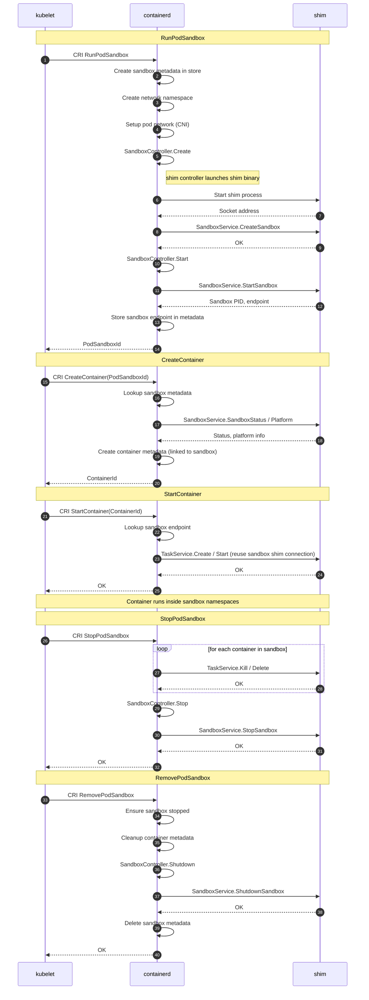

# Sandbox API {#sandbox-api}

Sandbox API 引入了一等公民的 sandbox 原语，用于管理共享资源、具有共同生命周期的一组容器。它完全基于既有的
[Runtime v2](../core/runtime/v2/README.md) shim 架构，在 shim 模型之上扩展出了专门的 sandbox 生命周期管理。

## 背景 {#background}

在 Runtime v2 模型中，containerd 为每个容器启动一个 shim 进程。shim 通过 ttrpc（或 gRPC）socket 暴露
[`TaskService`](../api/runtime/task/v3/shim.proto)，containerd 通过该连接发送 create/start/stop/delete 命令。这对单个容器来说效果不错，但当容器需要被编组到一个共享的执行环境——即一个 sandbox——中时就行不通了。

在 Kubernetes 中，Pod 是一组被一起调度并共享网络 namespace 等资源的容器。为实现这一点，Kubernetes 使用了一个
"pause 容器"——一个极简的容器，其唯一目的是充当父进程并让共享的 namespace 保持存活。应用容器在启动时加入这些
namespace。

Sandbox API 旨在把这一概念一般化。它把 sandbox 建模为一组容器的父环境——最先启动、最后结束，获取共享资源（例如网络
namespace 或 IP 地址）供子容器加入。

> [!NOTE]
> 本文中「pod sandbox」和「sandbox」指的是不同的东西。**pod sandbox** 是 CRI plugin 和 Kubernetes gRPC API
> （例如 `RunPodSandbox`）中使用的 Kubernetes 专有概念，传统上通过 pause 容器实现。**sandbox** 则是 Sandbox API
> 定义的通用抽象——pod sandbox 只是它的一种可能实现。

在 Sandbox API 出现之前，containerd 对这种编组没有一等公民的概念。pause 容器的生命周期和 sandbox 元数据完全由
CRI plugin 内部管理。这种做法有几个缺陷：

- 一刀切：该实现假定每个 sandbox 都是一个 pause 容器。模型不同的运行时，例如自行管理 sandbox（VMM）的基于 VM 的
  运行时，无法接入。

- 没有扩展点：sandbox 生命周期位于 CRI plugin 内部，运行时作者无法为自己的运行时定制行为。

- shim 生命周期与 task 绑定：shim 进程随 task 创建和销毁，而 sandbox 需要一个在容器来来去去期间始终存活的 shim。

Sandbox API 在 pod sandbox 实现之上提供了一层抽象，使运行时作者无需修改 containerd 或 CRI plugin 即可提供自己的
实现。设计目标是：

1. 在通用的 [`Controller`](../core/sandbox/controller.go) 接口之后，为容器编组提供更好的抽象，以支持诸如
   microVM 风格容器这类非标准用例。
   完整的 RPC 接口见 [`SandboxService`](../api/runtime/sandbox/v1/sandbox.proto) proto 定义。

2. 让 containerd 中的 CRI plugin 少一些主观预设、不再夹带实现细节。pause 容器预期将成为 Sandbox API 的实现之一，
   而不是一个硬编码的假设。

## 流程 {#flow}

下面的时序图展示了 kubelet 使用 `shim` sandbox controller 创建一个包含单个应用容器的 pod 时，CRI 调用的流程。容器
相关的细节（snapshot、OCI spec、NRI hook、退出监控）被省略了——这里的重点是 Sandbox API 的交互。

## Controller 实现 {#controller-implementations}

目前有两种 `Controller` 实现：

- `shim` —— 支持 Sandbox API 流程的 shim 二进制文件实现
  [`SandboxService`](../api/runtime/sandbox/v1/sandbox.proto) 的各个 RPC，原生处理 sandbox 生命周期。
  这是 Sandbox API 所面向的目标模型。

- `podsandbox` —— pause 容器实现，目前位于 CRI 的
  [`podsandbox/`](../internal/cri/server/podsandbox) 包中。

`podsandbox` controller 在技术上满足 `Controller` 接口，但实际上它是一个与 CRI 层紧耦合的内存实现。它之所以留在
那里，是因为重构复杂度较高——把它干净地移出去是一项庞大的渐进式工作，自 Sandbox API 在 containerd 1.7 中首次引入
以来一直在进行，并在每个发布版本中不断改进。

## 状态 {#status}

Sandbox API 于 containerd 1.7 中作为实验性 API 首次引入，并在 2.0 中提升为稳定。
它仍在演进中；进行中的工作可以在
[#9431](https://github.com/containerd/containerd/issues/9431) 追踪。
