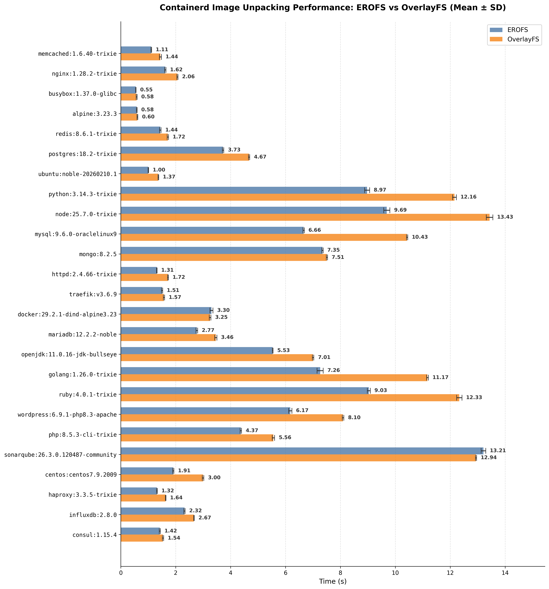
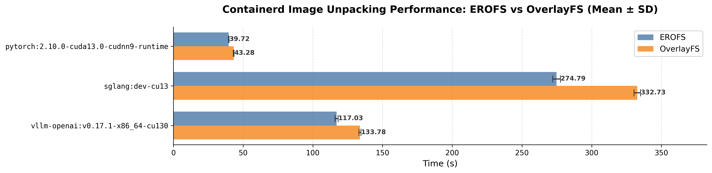

# EROFS Snapshotter {#erofs-snapshotter}

[EROFS](https://erofs.docs.kernel.org) snapshotter 是 containerd 原生的
snapshotter，用于启用 EROFS 文件系统，具体来说是为每个已提交的 snapshot 保存
EROFS 格式的 blob，并为每个活动 snapshot 准备 OverlayFS mount。

为了把 OCI 容器 image 直接转换成 EROFS 格式的 blob，必须在使用 EROFS
snapshotter 的同时指定 EROFS differ。否则，如果使用 walking differ，EROFS
snapshotter 的行为会与现有的 OverlayFS snapshotter 非常相似：walking differ 的
applier 会把当前 layer 解包到已挂载 OverlayFS 的活动 EROFS snapshot 中，然后
EROFS snapshotter 再把它提交为 EROFS 格式的 blob，这比使用 EROFS differ 更慢。
另请参阅 _[配置](#configuration)一节_。

尽管 EROFS snapshotter 听起来有点像增强版的 OverlayFS snapshotter，但有若干内核
特性与 EROFS 内部实现高度耦合，因此把它作为一个独立的 snapshotter 更为合适。这样
一来，现有的 OverlayFS 用户不会受到新的 EROFS 特有行为的影响，而感兴趣的用户也有
机会使用 EROFS 文件系统，甚至共同发展相关生态（例如 ComposeFS、机密容器、gVisor、
Kata、nerdbox 等）。

## 使用场景 {#use-cases}

EROFS snapshotter 可以让多种使用场景受益：

对于 runC 容器，它不再把单个文件解包到后端文件系统的某个目录中，而是把 OCI layer
应用到 EROFS blob 中，因此：

 - 提升 image 解包性能：解包过程中把 tar 归档实时转换为 EROFS 格式的 layer，与
   直接解包到宿主机文件系统相比：转换为 EROFS 格式的 layer 后，处理单个文件时不会
   产生额外的文件系统元数据日志流量，GC 未使用的 snapshot 时也无需删除大量文件；

   下面是使用 containerd 2.2.1 针对 OverlayFS snapshotter 的解包基准测试结果
   （从本地 registry 拉取，未启用并行解包）：

   
   

 - 现已原生支持并行解包，与 OverlayFS snapshotter 类似。这一能力在 blockfile、
   devmapper 和 ZFS 这类磁盘快照风格的 snapshotter 中很难实现。与只能使用 syncfs
   的 OverlayFS snapshotter 相比，它还使用了一种更高效的方式（通过 fsync）来持久化
   layer 数据；

 - 更好的数据持久化保证：与直接解包到宿主机文件系统相比，它通过对单个 EROFS 格式
   layer blob 执行 fsync，而不是每次都对整个磁盘执行 syncfs，从而提供了更好的语义。

 - 使用 FS_IMMUTABLE_FL 文件属性和 fsverity 为每个 snapshot 提供完整的数据保护。
   EROFS 使用 FS_IMMUTABLE_FL 和 fsverity 保护每个 EROFS layer blob，确保挂载出来
   的目录树保持不可变。不过，由于 FS_IMMUTABLE_FL 和 fsverity 保护的是单个文件而
   不是一棵子文件系统树，overlayfs snapshotter 之类的其他 snapshotter 实现至少在
   效率上并不太适用；

 - 支持把指定大小的块设备作为 OverlayFS 的上层，以限制可写 layer（通常是临时存储）
   的磁盘配额；

 - 专用的 EROFS 默认 mount handler 使 EROFS 可以使用文件后端 mount，从而在 runC 上
   避免使用 loop 设备。注意，特定的运行时 shim 无需这个内置 handler 也能处理 EROFS
   mount；更多细节参见
   [containerd Mounts 与 Mount 管理](../mounts.md)；

 - 原生 EROFS layer 可以直接从 registry 拉取，无需转换。

对于 VM 容器，EROFS snapshotter 可以高效地透传和共享 image layer，相比
[virtiofs](https://virtio-fs.gitlab.io) 或
[9p](https://www.kernel.org/doc/Documentation/filesystems/9p.txt)
提供了若干优势（例如更好的性能和更小的内存占用）。此外，广受欢迎的应用内核
[gVisor](https://gvisor.dev/) 也支持
[EROFS](https://github.com/google/gvisor/pull/9486)，以实现高效的 image 透传。

## 为什么选择 EROFS 而不是其他内核文件系统？ {#why-consider-erofs-over-other-kernel-filesystems}

EROFS 是专门设计的不可变文件系统，具有以下亮点：

 - **轻量、灵活的磁盘格式：** 为归档用途而设计，避免任何严重的文件系统一致性问题，
   并尽量减少攻击面。与 EXT4 之类的通用文件系统不同，它无需事先估算文件系统大小或
   inode 总数；

 - **多设备支持：** 可实现原生分层或内容寻址存储；

 - **块设备后端与文件后端 mount：** 自 Linux 6.12 起支持文件后端 mount，无需
   loopback 设备。这覆盖了最新的主流发行版，例如 RHEL 10、Fedora 40、Debian 13、
   Ubuntu 26.04 LTS（或搭配 HWE 内核的 24.04 LTS）等；

 - **内存共享：** 支持通过 virtio-pmem 使用 FSDAX，以及按 inode 的 page cache
   共享。

## 用法 {#usage}

### 确保 EROFS 文件系统可用 {#ensure-that-erofs-filesystem-is-available}

在较新的 Ubuntu/Debian 系统上，可以直接用 apt 命令安装 erofs-utils；在 Fedora 上
可以直接用 dnf 命令安装。

```bash
# Debian/Ubuntu
$ apt install erofs-utils
# Fedora
$ dnf install erofs-utils
```

确保 erofs-utils 版本为 1.7 或更高。

使用 EROFS snapshotter 时，在启动 containerd 之前还要确保已加载 _EROFS 内核模块_
（需要 Linux 5.4 或更高版本）：可以用 `modprobe erofs` 加载。

### 检查 EROFS snapshotter 和 differ 是否可用 {#checking-if-the-erofs-snapshotter-and-differ-are-available}

要检查 EROFS snapshotter 是否可用，运行以下命令：

```bash
$ ctr plugins ls | grep erofs
```

会显示如下信息：
```
io.containerd.snapshotter.v1           erofs                    linux/amd64    ok
io.containerd.differ.v1                erofs                    linux/amd64    ok
```

### 配置 {#configuration}

可以在 containerd 的 `config.toml` 中使用以下配置。修改配置后别忘了重启
containerd。

``` toml
  [plugins."io.containerd.snapshotter.v1.erofs"]
      # Enable fsverity support for EROFS layers, default is false
      enable_fsverity = true

      # Optional: Additional mount options for overlayfs
      ovl_mount_options = []

  [plugins."io.containerd.service.v1.diff-service"]
    default = ["erofs","walking"]
```

注意，如果 erofs-utils 版本为 1.8 或更高，可以给 differ 的 `mkfs_options` 添加
`-T0 --mkfs-time` 以启用可重现构建，如下所示：

``` toml
  [plugins."io.containerd.differ.v1.erofs"]
    mkfs_options = ["-T0", "--mkfs-time"]
```

如果 erofs-utils 为 1.8.2 或更高版本，建议给 differ 的 `mkfs_options` 追加
`--sort=none`，以避免不必要的 tar 数据重排序，从而提升性能，如下所示：

``` toml
  [plugins."io.containerd.differ.v1.erofs"]
    mkfs_options = ["-T0", "--mkfs-time", "--sort=none"]
```

### 运行容器 {#running-a-container}

要使用 EROFS snapshotter 运行容器，需要显式指定它：

```bash
$ # ensure that the image we are using exists; it is a regular OCI image
$ ctr image pull docker.io/library/busybox:latest
$ # run the container with the provides snapshotter
$ ctr run -rm -t --snapshotter erofs docker.io/library/busybox:latest hello sh
```

## 配额支持 {#quota-support}

EROFS 支持块模式，可以用指定的文件系统格式生成固定大小的虚拟块，作为 overlayfs
的上层，以启用磁盘配额。可以在 containerd 配置中使用 `default_size` 选项：

```toml
  [plugins."io.containerd.snapshotter.v1.erofs"]
    default_size = "20GiB"
```

## 数据完整性 {#data-integrity}

EROFS snapshotter 提供三种方式来加固数据完整性：

### 使用不可变文件属性保证数据完整性 {#data-integrity-with-immutable-file-attribute}

设置 `set_immutable = true` 后，EROFS snapshotter 会给每个 layer blob 打上
`IMMUTABLE_FL` 标记。这样可确保脏数据被立即刷盘，并且 EROFS layer blob 无法被
删除、重命名或修改。

不可变文件属性主要用于确保数据持久化并防止人为的数据丢失，但它无法检测由硬件故障
导致的数据损坏。由于它会刷写内存中的脏数据，可能会显著增加启动容器所需的解包时间：
例如在 EXT4 上，tensorflow:2.19.0 的解包时间增加了 108.86%（从 10.090s 增加到
21.074s）。不过，它对运行时性能没有影响。

### 使用 fs-verity 保证数据完整性 {#data-integrity-with-fs-verity}

设置 `enable_fsverity = true` 后，EROFS snapshotter 会：

 - 在提交时为 EROFS layer 启用 fs-verity；

 - 在挂载 layer 之前校验 fs-verity 状态；

 - 如果文件系统或内核不支持，则跳过 fs-verity。

fs-verity 方式可以保证 EROFS blob layer 永不改变，但会引入额外的运行时开销，因为
容器对容器 image 的所有读取都会变慢——它需要先校验 Merkle 哈希树。

### 使用 dm-verity 保证数据完整性 {#data-integrity-with-dm-verity}

EROFS snapshotter 支持 device-mapper verity，为每个 EROFS layer 提供块级完整性
校验。这种方式为每个 layer 创建一个 dm-verity 设备并以只读方式挂载。该 dm-verity
实现使用 `go-dmverity` Go 库，无需外部的 `veritysetup` 命令行工具。这要求 Linux
内核支持 dm-verity（CONFIG_DM_VERITY）并已加载 device-mapper 内核模块。

必须配置 differ 以生成 dm-verity 元数据：

```toml
[plugins."io.containerd.differ.v1.erofs"]
  enable_dmverity = true
```

启用 dm-verity 后，EROFS differ 会通过在 EROFS blob 后追加 Merkle 哈希树并生成
root hash 的方式，为每个 layer 应用 dm-verity 格式。哈希树内联存储在 layer blob
本身之中。root hash 和哈希偏移量以 JSON 格式保存在与 layer blob 相邻的 `.dmverity`
元数据文件中。其他所有 dm-verity 参数（块大小、salt 等）都存储在 layer blob 内的
superblock 中，并在挂载时自动检测。常规模式使用 4096 字节的块（标准页大小），而
tar index 模式使用 512 字节的块（dm-verity 的 logical_block_size 约束）。

可以通过 `dmverity_mode` 配置 snapshotter 来控制 dm-verity 的行为：

```toml
[plugins."io.containerd.snapshotter.v1.erofs"]
  dmverity_mode = "auto"  # Options: "auto" (default), "on", "off"
```

可用的模式如下：

- `"auto"`（默认）：如果某个 layer 存在 `.dmverity` 元数据，就使用 dm-verity，
  否则按常规 EROFS 挂载。这样可以在同一系统中混用启用和未启用 dm-verity 的 layer。

- `"on"`：要求所有 layer 都使用 dm-verity。如果某个 layer 缺少 `.dmverity` 元数据，
  挂载会报错失败。当你希望对所有 layer 强制执行完整性校验时使用此模式。

  > **重要**：如果在 differ 未启用 dm-verity 的情况下已经解包过 layer，之后才启用
  > `dmverity_mode = "on"`，那些已有的 layer 不会有 `.dmverity` 元数据文件。这种
  > 情况下，你必须清理已有的 snapshot，并在 differ 中配置 `enable_dmverity = true`、
  > 在 snapshotter 中配置 `dmverity_mode = "on"` 之后重新拉取 image。或者，使用
  > `dmverity_mode = "auto"` 以允许混用启用和未启用 dm-verity 的 layer。

- `"off"`：完全禁用 dm-verity，即使存在 `.dmverity` 元数据也是如此。layer 会按常规
  EROFS 挂载，不做完整性校验。在需要兼容性或 dm-verity 开销不可接受时使用此模式。

在启用 dm-verity 的情况下挂载 layer 时，snapshotter 会从 `.dmverity` 文件读取元数据
并创建 dm-verity 设备。dm-verity 库会自动从 superblock 读取所有参数，确保任何损坏或
篡改都能在读取时被检测到。随后该 dm-verity 设备会作为 OverlayFS 栈中的后端 layer
被挂载

## 工作原理 {#how-it-works}

对于每个 layer，EROFS snapshotter 会准备一个包含以下内容的目录：

```
  .erofslayer
  fs
  work
```

`.erofslayer` 文件用于标识该 layer 由 EROFS snapshotter 准备。

如果同时启用了 EROFS differ，differ 会检查 `.erofslayer` 是否存在，并把 image
内容 blob（例如一个 OCI layer）转换为 EROFS layer blob。

此时，snapshot layer 目录看起来是这样：
```
  .erofslayer
  fs
  layer.erofs
  work
```

如果启用了 dm-verity，还会出现一个 `.dmverity` 元数据文件：
```
  .erofslayer
  fs
  layer.erofs
  layer.erofs.dmverity
  work
```

接着 EROFS snapshotter 会检查 `layer.erofs` 是否存在：它会把 EROFS layer blob
挂载到 `fs/`，并返回一个包含所有父 layer 的有效 overlayfs mount。如果启用了
dm-verity 且 `.dmverity` 文件存在，snapshotter 会创建一个 dm-verity 设备并改为
挂载该设备。

如果使用的是其他 differ（不是 EROFS differ），EROFS snapshotter 会改为在 Commit
时把扁平目录转换成 EROFS layer blob。

换句话说，EROFS differ 只能与 EROFS snapshotter 搭配使用，否则它会跳到下一个
differ。而 EROFS snapshotter 在有无 EROFS differ 的情况下都能工作。

## Tar Index 模式 {#tar-index-mode}

EROFS differ 还支持一种 “tar index” 模式，为处理 OCI image layer 提供了一种独特的思路：

tar index 模式不会解包整个 tar 归档来创建 EROFS 文件系统，而是：
1. 为 tar 内容生成一份 tar index
2. 把原始 tar 内容追加到该 index 之后
3. 生成一个组合文件：`[Tar index][Original tar content]`

tar index 可以与 image layer 一起存放在 registry 中，让节点在需要时直接拉取。通常 tar index 比完整的 EROFS blob 小得多，因此存储和传输更高效。如果 registry 中没有 tar index，也可以在节点上生成作为兜底。在与 dm-verity 集成时，registry 还可以把 dm-verity 的 Merkle 树和 root hash 签名与 tar index 一起存储，使节点无需重复计算即可获取所有必要的制品。

此外，按照 OCI image spec，我们为每个 layer 都有一个 tar diffID，因此不必为机密容器重新发明一套校验 image layer 内容的方法，只需在 guest 中对 tar index 模式之外的原始 tar 数据计算 sha256（因为 erofs 可以直接复用 tar 数据，使用 512 字节的 fs 块大小并构建一个最小索引来直接挂载 tar），再与各个 diffID 比对即可。

### 配置 {#configuration-1}

对于 EROFS differ：

```toml
[plugins."io.containerd.differ.v1.erofs"]
  enable_tar_index = true
```
