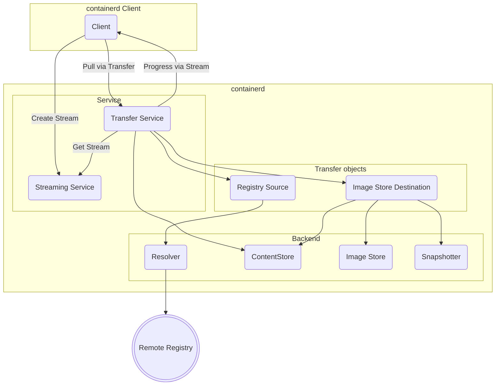

# Transfer 服务 {#transfer-service}

transfer 服务是一个简单而灵活的服务，可用于在源和目标之间传输 artifact 对象。这套灵活的 API 让 transfer 接口的每个实现都能自行判断源与目标之间的传输是否可行。这样一来，新功能可以直接由实现方添加，既不需要给 API 加版本，也不要求其他实现去处理接口变更。

transfer 服务建立在 libchan 项目提出的核心理念之上：把二进制流和数据通道作为一等对象的 API 更加灵活，能够支持更广泛的使用场景，而不需要不断更新协议和 API。为此，transfer 服务使用了 streaming 服务，使得即便在使用 grpc 和 ttrpc 时，transfer 对象也能访问二进制流和对象流。

## Transfer API {#transfer-api}

transfer API 只包含一个操作，可以根据预期的操作传入各种不同的对象来调用它。

在 Go 中该 API 形如：
```go
type Transferrer interface {
	Transfer(ctx context.Context, source any, destination any, opts ...Opt) error
}
```

proto API 形如：
```proto
service Transfer {
	rpc Transfer(TransferRequest) returns (google.protobuf.Empty);
}

message TransferRequest {
	google.protobuf.Any source = 1;
	google.protobuf.Any destination = 2;
	TransferOptions options = 3;
}

message TransferOptions {
 string progress_stream = 1;
 // Progress min interval
}
```

## Transfer 对象（源与目标） {#transfer-objects-sources-and-destinations}

## Transfer 操作 {#transfer-operations}

|   源    | 目标 | 说明 | 本地实现版本 |
|-------------|-------------|-------------|-----------------------|
| Registry    | Image Store | "pull"      | 1.7 |
| Image Store | Registry    | "push"      | 1.7 |
| Object stream (Archive) | Image Store | "import" | 1.7 |
| Image Store | Object stream (Archive) | "export" | 1.7 |
| Object stream (Layer) | Mount/Snapshot | "unpack" | 未实现 |
| Mount/Snapshot | Object stream (Layer) | "diff" | 未实现 |
| Image Store | Image Store | "tag" | 1.7 |
| Registry | Registry | 在 registry 之间镜像 image | 未实现 |

### 本地 containerd daemon 的支持 {#local-containerd-daemon-support}

containerd 内置了一个 transfer plugin，实现了大部分基本的 transfer 操作。这个本地 plugin 的配置方式与其他 containerd plugin 相同
```
[plugins]
[plugins."io.containerd.transfer.v1"]
```

## 示意图 {#diagram}

拉取（pull）流程的各个组件



## Streaming {#streaming}

transfer 服务使用 streaming 来在操作过程中发送或接收数据流，以及处理回调（同步或异步）。streaming 协议对客户端的 Go 接口应当是不可见的。func、reader、writer 之类的对象类型在经过 RPC 时可以被透明地转换为 streaming 协议。客户端和服务端接口可以保持不变，只需 proto 的 marshal 和 unmarshal 过程感知 streaming 协议并能访问 stream manager。stream 由客户端通过客户端侧的 stream manager 创建，并以字符串形式的 stream 标识符经由 proto RPC 发送。服务端的服务实现可以使用服务端侧的 stream manager 通过 stream 标识符查找对应的 stream。

### 进度 {#progress}

进度是一个由服务端发送给客户端的异步回调。在 Go 接口中，它通常表示为一个简单的回调函数，由客户端实现、由服务端调用。

从 Go 类型来看，进度使用下面这些类型
```go
type ProgressFunc func(Progress)

type Progress struct {
	Event    string
	Name     string
	Parents  []string
	Progress int64
	Total    int64
}
```

通过 stream 发送的 proto 消息类型是

```proto
message Progress {
	string event = 1;
	string name = 2;
	repeated string parents = 3;
	int64 progress = 4;
	int64 total = 5;
}
```

进度可以作为一个 transfer 选项传入，从而获取任意 transfer 操作的进度。不同的 transfer 操作产生的进度事件可能不同。

### 二进制流 {#binary-streams}

transfer 对象也可以直接使用 `io.Reader` 和 `io.WriteCloser`。

字节数据通过两个简单的 proto 消息类型在 stream 上传输
```proto
message Data {
	bytes data = 1;
}

message WindowUpdate {
	int32 update = 1;
}

```

发送方发送 `Data` 消息，接收方发送 `WindowUpdate` 消息。当客户端发送 `io.Reader` 时，客户端是发送方，服务端是接收方。当客户端发送 `io.WriteCloser` 时，服务端是发送方，客户端是接收方。

二进制流用于 import（发送 `io.Reader`）和 export（发送 `io.WriteCloser`）。

### 凭据 {#credentials}

凭据以从服务端到客户端的同步回调方式处理。当服务端遇到来自 registry 的授权请求时，就会发起该回调。

在 transfer 对象中使用凭据 helper 的 Go 接口形如
```go
type CredentialHelper interface {
	GetCredentials(ctx context.Context, ref, host string) (Credentials, error)
}

type Credentials struct {
	Host     string
	Username string
	Secret   string
	Header   string
}

```

它通过下面这些 proto 消息在 stream 上发送
```proto
// AuthRequest is sent as a callback on a stream
message AuthRequest {
	// host is the registry host
	string host = 1;

	// reference is the namespace and repository name requested from the registry
	string reference = 2;

	// wwwauthenticate is the HTTP WWW-Authenticate header values returned from the registry
	repeated string wwwauthenticate = 3;
}

enum AuthType {
	NONE = 0;

	// CREDENTIALS is used to exchange username/password for access token
	// using an oauth or "Docker Registry Token" server
	CREDENTIALS = 1;

	// REFRESH is used to exchange secret for access token using an oauth
	// or "Docker Registry Token" server
	REFRESH = 2;

	// HEADER is used to set the HTTP Authorization header to secret
	// directly for the registry.
	// Value should be `<auth-scheme> <authorization-parameters>`
	HEADER = 3;
}

message AuthResponse {
	AuthType authType = 1;
	string secret = 2;
	string username = 3;
	google.protobuf.Timestamp expire_at = 4;
}
```
